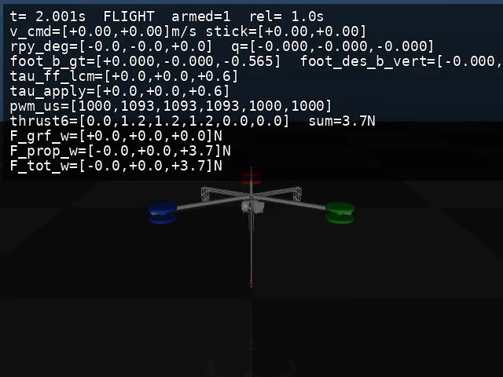
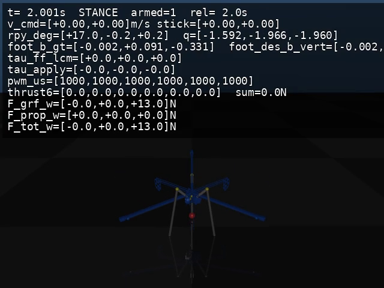
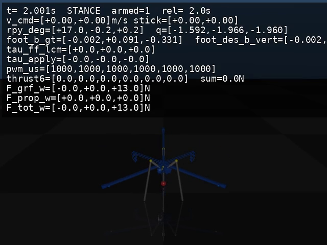

# Hopper_sim

Hopper 机器人仿真环境集合（**3 个模型**），用于复现/对比：

- **ModeE (Hopper-aero / LCM)**：MuJoCo 里跑“假机器人”进程，通过 LCM 跑真实 ModeE 控制器（本仓库内拷贝，独立可运行）。
- **Hopper4 LEG-only (LCM)**：Hopper4 虚拟弹簧 + Raibert（只用腿，不启用螺旋桨）。
- **Hopper4 PROP (LCM)**：Hopper4 介入螺旋桨（自动 ARM，飞行段姿态 PD + 分配）。

## 🎬 Demo 视频（README 可直接点开）

- **Model 1 — ModeE (serial) in-place hop**

[](videos/modee_serial_inplace.mp4)

- **Model 2 — Hopper4 LEG-only in-place hop**

[](videos/hopper4_leg_inplace.mp4)

- **Model 3 — Hopper4 PROP in-place hop**

[](videos/hopper4_prop_inplace.mp4)

## 📁 目录结构

```
Hopper_sim/
├── hopper_lcm_types/               # LCM 消息定义（Python 生成代码）
├── mjcf/                           # MuJoCo 模型（serial + 3RSR）+ meshes
├── videos/                         # README 展示用 MP4 + 缩略图
│
├── model_aero/                     # Model 1: ModeE + MuJoCo fake-robot (LCM)
│   ├── mujoco_lcm_fake_robot.py
│   ├── run_modee.py
│   └── record_modee_serial_inplace.sh
│
├── model_spring/                   # Model 2: Hopper4 LEG-only (LCM)
│   ├── Hopper4.py
│   ├── run_hopper4_leg_sim.py
│   └── record_hopper4_leg_inplace.sh
│
└── model_hopper4_prop/             # Model 3: Hopper4 PROP (LCM)
    ├── Hopper4.py
    ├── run_hopper4_prop_sim.py
    └── record_hopper4_prop_inplace.sh
```

## 🚀 Model 1: `model_aero`（ModeE / serial fixed）

### 一键录制（推荐）

```bash
cd Hopper_sim/model_aero
bash record_modee_serial_inplace.sh
```

输出会写到：

- `Hopper_sim/videos/modee_serial_inplace.mp4`

### 手动运行（两个终端）

```bash
# Terminal A
cd Hopper_sim/model_aero
python3 mujoco_lcm_fake_robot.py --arm --viewer

# Terminal B
cd Hopper_sim/model_aero
python3 run_modee.py --leg-model serial --tau-out-max 2500
```

## 🦵 Model 2: `model_spring`（Hopper4 LEG-only / LCM）

### 一键录制

```bash
cd Hopper_sim/model_spring
bash record_hopper4_leg_inplace.sh
```

输出会写到：

- `Hopper_sim/videos/hopper4_leg_inplace.mp4`

## 🚁 Model 3: `model_hopper4_prop`（Hopper4 PROP / LCM）

### 一键录制

```bash
cd Hopper_sim/model_hopper4_prop
bash record_hopper4_prop_inplace.sh
```

输出会写到：

- `Hopper_sim/videos/hopper4_prop_inplace.mp4`

## 📝 依赖

### 共同依赖
- Python 3.8+
- NumPy
- MuJoCo Python bindings
- LCM (Lightweight Communications and Marshalling)

### 说明
- `Hopper_sim/videos/` 里的 MP4 很小（用于 README 展示），可以直接 commit 到 GitHub。

## 🔗 相关项目

- **Hopper-aero**: 真机控制代码（ModeE 原始来源）
- **Hopper-mujoco**: 3RSR/serial MJCF 来源

## 📚 参考

- Raibert 控制器论文
- Mini Cheetah MPC + Raibert Heuristics
- PogoX: Parallel Leg Hopping Robot

