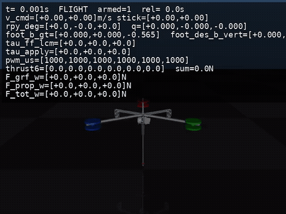
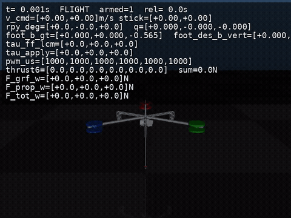
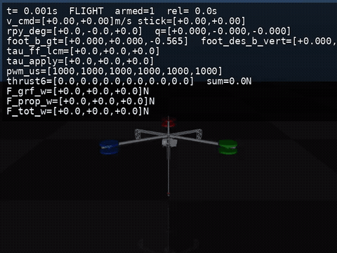

# Hopper_sim

A collection of **3 simulation models** for the Hopper robot, enabling comparison and reproduction of different control strategies:

1. **ModeE (Hopper-aero / LCM)**: Runs the real ModeE controller (from `Hopper-aero`) against a MuJoCo "fake robot" process via LCM communication.
2. **Hopper4 LEG-only (LCM)**: Hopper4 virtual spring + Raibert controller (legs only, propellers disabled).
3. **Hopper4 PROP (LCM)**: Hopper4 controller with propeller assistance (auto-armed, attitude PD control + thrust allocation during flight).

## 📁 Directory Structure

```
Hopper_sim/
├── hopper_lcm_types/               # LCM message definitions (Python generated code)
├── mjcf/                           # MuJoCo model (serial roll/pitch/shift) + meshes
├── videos/                         # Demo GIF videos
│
├── model_aero/                     # Model 1: ModeE + MuJoCo fake-robot (LCM)
│   ├── mujoco_lcm_fake_robot.py
│   ├── run_modee.py
│   ├── modee/                      # ModeE controller code (self-contained)
│   └── record_modee_serial_inplace.sh
│
├── model_spring/                   # Model 2: Hopper4 LEG-only (LCM)
│   ├── Hopper4.py
│   ├── run_hopper4_leg_sim.py
│   └── record_hopper4_leg_inplace.sh
│
└── model_hopper4_prop/             # Model 3: Hopper4 PROP (LCM)
    ├── Hopper4.py
    ├── run_hopper4_prop_sim.py
    └── record_hopper4_prop_inplace.sh
```

## 🚀 Model 1: `model_aero` (ModeE Controller)

**Description**: This model runs the **real ModeE controller** (from `Hopper-aero`) in a closed-loop simulation. A MuJoCo process (`mujoco_lcm_fake_robot.py`) emulates the robot hardware and communicates with the controller via LCM, exactly as the real robot would.

**Key Features**:
- **SRB-MPC** (Single Rigid Body Model Predictive Control) for stance phase ground reaction force generation
- **WBC-QP** (Whole-Body Control Quadratic Program) for force/torque allocation
- **Raibert-style foot placement (S2S)** for velocity control
- **Serial-equivalent leg model** (Roll/Pitch/Shift joints) with correct LCM mapping

**Quick Start**:

```bash
cd Hopper_sim/model_aero
bash record_modee_serial_inplace.sh
```

Output: `Hopper_sim/videos/modee_task_3s0_5s_fwd_3s0.mp4`

**Manual Run** (two terminals):

```bash
# Terminal A: MuJoCo fake robot
cd Hopper_sim/model_aero
python3 mujoco_lcm_fake_robot.py --arm --viewer --model ../mjcf/hopper_serial.xml --q-sign 1 --q-offset 0 --leg-model serial --tau-out-max 2500

# Terminal B: ModeE controller
cd Hopper_sim/model_aero
python3 run_modee.py --leg-model serial --tau-out-max 2500
```

## 🦵 Model 2: `model_spring` (Hopper4 LEG-only)

**Description**: This model runs the **Hopper4 virtual spring controller** with Raibert-style foot placement, but **propellers are disabled**. The robot relies solely on leg dynamics for hopping.

**Key Features**:
- **Virtual spring + energy injection** during stance compression/extension
- **Raibert controller** for horizontal velocity control via foot placement
- **Foot-space PD control** during flight for leg trajectory tracking
- **No propeller assistance** (pure leg dynamics)

**Quick Start**:

```bash
cd Hopper_sim/model_spring
bash record_hopper4_leg_inplace.sh
```

Output: `Hopper_sim/videos/hopper4_leg_task_3s0_5s_fwd_3s0.mp4`

**Manual Run**:

```bash
cd Hopper_sim/model_spring
python3 run_hopper4_leg_sim.py
```

## 🚁 Model 3: `model_hopper4_prop` (Hopper4 with Propellers)

**Description**: This model runs the **Hopper4 controller with propeller assistance**. Propellers are automatically armed and provide roll/pitch attitude control during flight, while the leg controller handles stance and foot placement.

**Key Features**:
- **Virtual spring + energy injection** (same as Model 2)
- **Raibert controller** for horizontal velocity control
- **Propeller roll/pitch PD control** during flight
- **Thrust allocation** via inverse mixing matrix (`A_inv`)
- **PWM mapping** based on `k_thrust` square-root relationship

**Quick Start**:

```bash
cd Hopper_sim/model_hopper4_prop
bash record_hopper4_prop_inplace.sh
```

Output: `Hopper_sim/videos/hopper4_prop_task_3s0_5s_fwd_3s0.mp4`

**Manual Run**:

```bash
cd Hopper_sim/model_hopper4_prop
python3 run_hopper4_prop_sim.py
```

## 📝 Dependencies

### Common Requirements
- Python 3.8+
- NumPy
- MuJoCo Python bindings (`mujoco`)
- LCM (Lightweight Communications and Marshalling)

### Installation

```bash
# Install MuJoCo
pip install mujoco

# Install LCM (if not already installed)
# See: https://lcm-proj.github.io/lcm/
```

## 🔗 Related Projects

- **Hopper-aero**: Real robot control code (source of ModeE controller)
- **Hopper-mujoco**: Original MuJoCo models (serial MJCF)

## 📚 References

- Raibert, M. H. (1986). *Legged Robots That Balance*. MIT Press.
- Mini Cheetah MPC + Raibert Heuristics
- PogoX: Parallel Leg Hopping Robot

---

## 🎬 Demo Videos

All demos follow the same task: **3s in-place hopping → 5s forward → 3s in-place hopping**.

### Model 1 — ModeE (Serial) Demo



### Model 2 — Hopper4 LEG-only Demo



### Model 3 — Hopper4 PROP Demo


